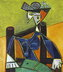

## Ссылки и картинки

### Картинки

Картинки работают почти идентично ссылкам, но начинаются с "!"\

* **alt** - текст, заменяющий картинку, когда она почему-либо не может быть отображена.\
alt-текст можно не указывать, но квадратные скобки [] необходимы
* **title** - текст, дающий доп. инфомацию о картинке, появляется во всплывающей подсказке

Как и ссылки, картинки можно описывать двумя способами: одной или двумя строками.
Также картинки могут быть ссылками на web-страницы или другие картинки.

#### Описание картинки одной строкой

*Схема записи:*
```md

```
**Пример 1.**\
*Удалённое изображение одной строкой*\


**Пример 2.**\
*Локальное изображение одной строкой*\



#### Описание картинки двумя строками

*Схема записи:*
```md
![Alt текст][img_id]
---Перед второй частью нужна пустая строка---

[img_id]:local/or/remote/path/to/image "Title текст"
```
**Пример 3.**\
*Локальное изображение двумя строками*\
![Tux с ноутом][tux_img]

[tux_img]:markdown_памятка.files/tux.png "Очень умный пингвин"

**Пример 4.**\
*Удалённое изображение двумя строками*\
![Красотка из Марумби][pretty_woman_img]

[pretty_woman_img]:https://theblueprint.ru/upload/12822/1027fec3adffb100c91b61cde6734d68.jpg "Знойная женщина, мечта поэта"


### Описание картинки со ссылкой одной строкой:

*Схема записи:*
```md
[](remote/path/to/page/or/image)
```
**Пример 5.**\
*Локальная картинка ссылается на web-страницу одной строкой*\
[](https://yandex.ru/)

**Пример 6.**\
*Локальная картинка ссылается на удалённую картинку одной строкой*\
[](https://w7.pngwing.com/pngs/885/573/png-transparent-futurama-character-illustration-futurama-philip-j-fry-leela-bender-mom-futurama-fry-face-hat-heroes.png)

**Пример 7.**\
*Удалённая картинка ссылается на web-страницу одной строкой*\
[](https://www.google.com/)

**Пример 8.**\
*Удалённая картинка ссылается на удалённую картинку одной строкой*\
[](https://gadgetynews.com/wp-content/uploads/2012/01/Leela-Futurama.jpg)


### Описание картинки со ссылкой двумя тремя строками:

*Схема записи:*
```md
[![Alt текст][img_id]][link_id]
---Перед второй частью нужна пустая строка---

[img_id]:local/or/remote/path/to/image "Title text"
[lnk_id]:remote/path/to/page/or/image
```
**Пример 9.**\
*Локальная картинка ссылается на web-страницу тремя частями*\
[![Локальная собачка][dog_img_id]][dog_lnk_id]

[dog_img_id]:markdown_памятка.files/small_dog.jpg "Джек-рассел терьер"
[dog_lnk_id]:https://lapkins.ru/dog/dzhek-rassel-terer/ "Two"

**Пример 10.**\
*Локальная картинка ссылается на удалённую картинку тремя частями*\
[![Локальная кошка][cat_img_id]][cat_lnk_id]

[cat_img_id]:markdown_памятка.files/small_cat.jpg "Милота 90-го уровня"
[cat_lnk_id]:https://i.pinimg.com/originals/b7/3d/38/b73d386baa38b6ab19071594d4a16e45.jpg

**Пример 11.**\
*Удалённая картинка ссылается на web-страницу тремя частями*\
[![Милашка Рэйчел][rachel_img_id]][rachel_lnk_id]

[rachel_img_id]:https://i.pinimg.com/736x/04/3a/4b/043a4b22bbdea2dc36affc55a5a92d79--the-vow-the-notebook.jpg "Рэйчел МакАдамс"
[rachel_lnk_id]:https://www.kinopoisk.ru/name/36310/


**Пример 12.**\
*Удалённая картинка ссылается на удалённую картинку тремя частями*\
[![Старина Линус][linus_img_id]][linus_lnk_id]

[linus_img_id]:https://avatars.mds.yandex.net/get-zen_doc/1054867/pub_5c2247e4aa910500a92471cb_5c22481f1fdf2500aa89d25d/scale_1200 "Linus Torvalds"
[linus_lnk_id]:https://upload.wikimedia.org/wikipedia/commons/b/b1/LinuxCon_Europe_Linus_Torvalds_05.jpg


### Резюме по схемам записи
```md
ССЫЛКИ
===================================================================

Ссылка одной строкой
--------------------
[Текст ссылки](http://example.com/ "Необязательная подсказка")  

Cсылка двумя строками
---------------------
[Текст ссылки][lnk_id]
---Перед второй частью нужна пустая строка---

[lnk_id]:http://example.com/ "Необязательная подсказка"

КАРТИНКИ
===================================================================

Картинка одной строкой
----------------------


Картинка двумя строками
-----------------------
![Alt текст][img_id]
---Перед второй частью нужна пустая строка---

[img_id]:local/or/remote/path/to/image "Title текст"

КАРТИНКИ СО ССЫЛКАМИ
===================================================================

Картинка со ссылкой одной строкой
---------------------------------
[](remote/path/to/page/or/image)

Картинка со ссылкой двумя (вернее тремя) строками
-------------------------------------------------
[![Alt текст][img_id]][link_id]
---Перед второй частью нужна пустая строка---

[img_id]:local/or/remote/path/to/image "Title text"
[lnk_id]:remote/path/to/page/or/image
```


Java
:    Хороший язык

JS
:    Плохой язык


