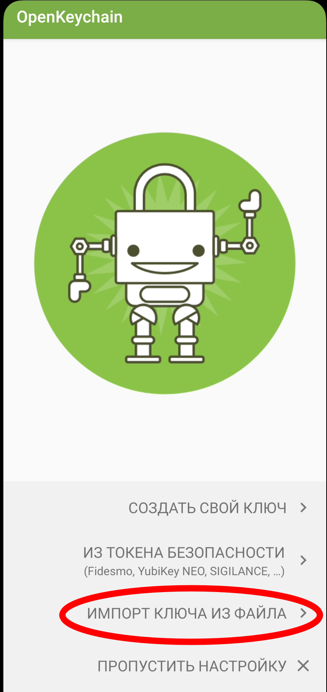

### Переезд с lastpass
21.03.16-22

bitwarden
---------
https://bitwarden.com/
На этом всё, по-ходу и закончилось. =)))
Всё удобно и чётко:
Браузер работает
Андроид работае
Импорт из lastpass'а прошёл гладко.
Минуса:
- На десктопе нет "пипочек" как у ластпасса в полях для заполнения.
- cli немного дубовый.
- при добавлении пароля не даёт выбрать папку. Мелочь.

KeePassXC + KeepassXC-Browser + KeepassDX на мобиле.
---------
https://chrome.google.com/webstore/detail/keepassxc-browser/oboonakemofpalcgghocfoadofidjkkk
Плюс: база данных в формате keepass хранится локально (или на gdrive).
Минус: браузерное дополнение работает как попало, даже ластпасс был лучше в этом смысле.
Есть автоввод из основной программы с помощью горячих клавишь, но тоже работает через пизду.
В приципе этой штукой можно пользоваться без браузерного расширения: 
открываем окно программы, находим нужную запись, горячими клавишами копируем логи, вставляем,
копируем пароль, вставляем. В принципе - нормально. 

Мобильное приложение работает сносно.

pass + qtpass + browserpass + Password Store на мобиле
---------------------------
*Уделил этой истории достаточно много времени*

https://www.passwordstore.org/
https://qtpass.org/
https://github.com/browserpass/browserpass-native
https://github.com/browserpass/browserpass-extension
https://github.com/android-password-store/Android-Password-Store
Изначально юниксовый инструмент. Под винду есть решение, я не тестил.
Сильно напомнило keepassxs + браузерное расширение.
Суть такая: консольная утилита создаёт хранилище, в котором хранит пароли в виде текстовых
файлов, зашифрованных с помощью gpg. На каждый пароль - отдельный файл. 
Внутри файла может быть любая инфа. Импорт из ластпасса выглядит примерно так:
>89174761203870126850
>login: 16879196
>url: https://online.vtb.ru/content/v/ru/login.html?redirectPath=/content/telebank-client/ru/login/telebank.html
>comments: Пароль может содержать только цифры
Минус по сравнению с keepassxc в том, что в последнем предусмотрены поля для хранения логина,
пароля, url, заметок и т.д.. В pass это просто прописано в тексте файла.
Ещё не попробовал хранение на gdrive.
browserpass - плагин для браузера, мне показалось, что работает чуть лучше, чем у keepassxc
**В любом случае это хуже, чем laspass и bitwarden,
НО ЭТО ГОРАЗДО КРУЧЕ, УВЛЕКАТЕЛЬНЕЕ И ЮНИКСОВЕЕ!**

*В сравнении с KeepassXC:*

- На мой взгляд хранение всего в одном файле удобнее. Ну и с точки зрения безопасности: в
  случае утечки базы keepassxc злоумышленник не видит список сайтов, пароли на которые
  содержатся в базе, а в случае утечки хранилища pass видит.
- Я плохо понимаю устройство gpg. Не известно как будет выглядеть смена линуха или настройка
  под виндой.
- qtpass выглядит более убого, чем KeepassXC. Хотя функционал вроде бы достаточен.
- browserpass не умеет создавать записи, при регистрации на новом сервисе.
- очень непростая настройка (первый раз) и очень много задействованных инструментов:
  На десктопе:
  - непосредственно pass. Если нужен гуи, то ещё qtpass
  - git для синхронизации через github.
  - Browserpass-native (пакет browserpass) - хост для взаимодействия pass и браузерного
    расширения.
  - Browserpass (пакет browserpass-chrome или можно установить из магазина chrome) - браузерное
    расширение
  На мобиле:
  - Password Store
  - OpenKeychain
  В случае KeepassXC используются три приложения: десктопное, браузерное и мобильное.

+ Мне показалось, что browserpass работает лучше, чем keepassxc-browser
+ Мощный cli-интерфейс.
+ Возможность использовать в качестве бэкап-сервера гитхаб
+ мобильное приложение (вернее связка openkeychain + password-store) работают круто.

Как работать с синхронизацией через github:
1. Исходим из того, что локальное хранилище уже создано.
2. 

*ПОТЕСТИТЬ МОБИЛЬНОЕ ПРИЛОЖЕНИЕ.*

## Как заставить всё это безобразие работать

### На компе

#### ШАГ 1: GPG

Скорее всего нужный пакет уже установлен, но если вдруг нет, то
```sh
yay -S gnupg
```
```sh
# Генерим ключ
gpg --full-generate-key # можно добавить --expert, больше настроек
# Тип ключа: по-умолчанию (RSA и RSA).
# Размер ключа: по-умолчанию (3072).
# Cрок действия: по-умолчанию (0)
# Ваше полное имя: Ivan Pimchenko
# Адрес электронной почты: i.pimchenko@gmail.com
# Примечание: My first key (не знаю зачем оно, но лучше ахинею не писать, иногда отображается)
# Фраза-пароль:
# Собственно всё, ключ создан.
```
#### ШАГ 2: СОЗДАНИЕ ХРАНИЛИЩА ПАРОЛЕЙ
```sh
# Устанавливаем pass
yay -S pass 

# Создаём хранилище паролей, тут всё максимально просто.
pass init i.pimchenko@gmail.com # почта, заданная во время создания ключей на предыдущем шаге
# В рез-те создаётся директория ~/.password-store/, в которой будут храниться пароли
```

#### ШАГ 3: ИМПОРТ ИЗ LASTPASS
```sh
# установка утилиты pass-import
yay -S pass pass-import
# это утилита на питоне умеющая импортировать из многих парольных менеджеров в несколько
# парольных менеджеров. В случае c lastpass->pass отработала безупречно, да и вообще показалась
# мне весьма годной.

# Собственно импорт из предварительно экспортированной базы lastpass
pimport pass lastpass путь/к/экспотированному/из/lastpass/файлу.csv --out ~/.password-store
# аргументы:
# pass - в какой парольный менеджер экспортируем
# lastpass - из какого парольного менеджера импортируем
# остальное ясно по смыслу

# просто чтобы убедиться, что всё прошло гут
pass 
```

#### ШАГ 3: СИНХРОНИЗАЦИЯ С GITHUB

Наверняка нужный пакет уже установлен, но если вдруг нет, то
```sh
# установка пакета git
yay -S git

# подключаем git к .password-store:
pass git init
# Первый раз я сделал иначе: cd ~/.password-store; git init. Вроде всё работало норм, но лучше
# делать через pass git init, при таком подходе создаётся дополнительный файл .gittatributes,
# не знаю его назначения.
```
Далее идём в браузер, заходим в свой акк на гитхабе, создаём новый репо (приватный), копируем
ссыль на него, путь это будет: https://github.com/ipimko/.password-store
P.S. Есть гитхабовская утилита, пакет github-cli, можно создавать репо через неё, она
показалась мне максимально интуитивной. Хотя она как-то слишком часто обращается к браузеру,
поэтому не уверен в её полезности.

```sh
# Создаём удалённый репозиторий
pass git remote add origin https://github.com/ipimko/.password-store # ссылка из предыдущего шага.
# Эта операция пока что создаёт удалённый репозиторий локально (противоречивенько, однако =))),
# но ещё не выгружает его на сервер.

# Выгружаем созданный репозиторий на сервер
pass git push -u --all
# Будет запрос логина и пароля для авторизации на гитхаб.
```

#### ШАГ 4: ЭКСПОРТ КЛЮЧЕЙ
Теперь нужно экспортировать ключ для того, чтобы перенести его в мобилу и использовать далее.
Информация отсюда:
https://www.openkeychain.org/faq/#how-to-import-an-openkeychain-backup-with-gpg
```sh
# Генерим временный пароль, которым дальше зашифруем экспортируемые ключи
gpg --armor --gen-random 1 20

# Шифруем экспортируемые ключи. Пароль из предыдущего шага.
gpg --armor --export-secret-keys i.pimchenko@gmail.com | gpg --armor --symmetric --output mykey.sec.asc
```
Закидываем полученный файл на гуглодрайв, или любым другим способом переносим в смарт.


### На мобиле

#### ШАГ 5: ПРИЛОЖЕНИЯ

**OpenKeychain**:
https://play.google.com/store/apps/details?id=org.sufficientlysecure.keychain


Открыть приложение, нажать "импорт ключа из файла", ввести пароль (тот что был создан во время
экспорта ключа командой `gpg --armor --gen-random 1 20`), нажать "Резервный ключ (нажмите д...),
нажать "Импорт".
См. скрины:

Original  


Resize


Password Store;
https://play.google.com/store/apps/details?id=dev.msfjarvis.aps

Открыть приложение, нажать "Поехали", нажать "клонировать удалённый репозиторий".
На экране "Информация о репозитории"


https://ipimko@github.com/ipimko/password-store 

Правильный вид cсылки на репо: https://ipimko@github.com/ipimko/.password-store


Почему оно должно записываться именно так, я х.з.
На конец марта документация у приложения в состоянии "переписывание с нуля", вот ссылка на старую
документацию на эту тему:
https://github.com/android-password-store/Android-Password-Store/wiki/Setting-up-Password-Store-to-sync-with-a-local-computer


OpenKeychain настроен, Password store синхронизирован с github, но при тапе на любой записи
пароля происходит быстрая смена картинки туда-обратно, как будто password-store куда-то
переключается, затем переключается обратно. Лечится так: см скрин:
Настройки -> Приложения -> Все приложения -> OpenKeychain -> Другие разрешения -> Отображать
всплывающие окна, когда запущено в фоновом режиме -> Вкл.
Можно заодно поразрешать ему вообще всё что можно и нельзя, на всякий пожарный... :-)


-----------------------------------------------------------------------------------------------


Отклонены и не рассмотрены ввиду отсутствия поддержки Linux (при этом в браузере могут работать)
================================================================================================

safe-in-cloud
https://www.safe-in-cloud.com/ru/

passit
https://passit.io/

onesafe
https://www.onesafe-apps.com/


Отклонены и не рассмотрены ввиду платности
==========================================

1password
https://www.keepersecurity.com/ru_RU/

keeper
https://www.keepersecurity.com/ru_RU/

dashlane
https://www.dashlane.com/

enpass
https://www.enpass.io/pricing/


Отклонены по иным причинам
==========================

webpass
https://webpass.pro/ru
Только корпоративный

Пассворк
https://passwork.ru/
Только корпоративный

