Настройка pass, qtpass и browserpass на компе + password store на андроид
-------------------------------------------------------------------------

## Действия на компе

### 1. GPG

1. Скорее всего нужный пакет уже установлен, если нет, то:\
`yay -S gnupg`

2. Генерим ключ:\
`gpg --full-generate-key # можно добавить --expert, больше настроек`
   >`Тип ключа`: по-умолчанию (RSA и RSA)\
   >`Размер ключа`: по-умолчанию (3072)\
   >`Cрок действия`: по-умолчанию (0)\
   >`Ваше полное имя`: произвольное имя\
   >`Адрес электронной почты`: почта используется как идентификатор, я так понимаю, что ни для
   > чего больше (типа восстановления забытого пароля) она не нужна, думаю можно использовать
   > фиктивный адрес\
   >`Примечание`: произвольный текст, лучше ахинею не писать, иногда где-то отображается\
   >`Фраза-пароль`: появится окно для ввода пароля (парольной фразы)

3. Чтобы удостовериться, что всё прошло хорошо:\
`gpg -K`\
должна быть выведена информация о ключах

**РЕЗУЛЬТАТ: создан ключ, защищённый парольной фразой.**

### 2. СОЗДАНИЕ ХРАНИЛИЩА ПАРОЛЕЙ

1. Устанавливаем pass:\
`yay -S pass`

2. Создаём хранилище паролей:\
`pass init <email>`
   >Нужно указывать почту, заданную во время создания ключей на предыдущем шаге. 

**РЕЗУЛЬТАТ: создана директория `~/.password-store/`, в которой будут храниться пароли**


### 3. ИМПОРТ БАЗЫ ИЗ LASTPASS

Импорт производится с помощью утилиты `pass-import`, написанной на питоне, она умеет
импортировать из многих парольных менеджеров в несколько парольных менеджеров. В случае c
lastpass -> pass она отработала безупречно, да и вообще показалась мне весьма годной.

Страница утилиты:  
https://github.com/roddhjav/pass-import

1. установка утилиты pass-import:\
`yay -S pass pass-import`

2. Собственно импорт из предварительно экспортированной базы lastpass:\
`pimport pass lastpass <lastpass_export.csv> --out ~/.password-store`
    >`pass` - парольный менеджер, в который экспортируем\
    >`lastpass` - парольный менеджер, из которого импортируем\
    >`<lastpass_export.csv>` - предварительно экспортированный из lastpass файл\
    >--out ~/.password-store - путь к хранилищу паролей

3.  Чтобы убедиться, что всё прошло хорошо:\
`pass`\
должно быть выведено дерево паролей.

**РЕЗУЛЬТАТ: хранилище паролей заполнено импортированными из lastpass паролями.**

### 4. УСТАНОВКА БРАУЗЕРНОГО РАСШИРЕНИЯ

Автозаполнение в браузере осуществляется через расширение browserpass. Настроек у расширения
минимум, имееются две горячие клавиши, их можно переназначить. К сожалению расширение не умеет
добавлять в базу новые логины/пароли. В остальном работает хорошо. Расширение состоит из двух
частей: собственно браузерная часть `browserpass` и дополнительная системная утилита-хост
`browserpass native`.

Ссылки на страницы приложения:  
https://github.com/browserpass/browserpass-extension  
https://github.com/browserpass/browserpass-native  

1. Устанавливаем расширение для chrome:\
`yay -S browserpass-chrome`\
Также можно установить его через [магазин](https://chrome.google.com/webstore/detail/browserpass/naepdomgkenhinolocfifgehidddafch?hl=ru) chrome.

2. Устанавливаем системный `browserpass native`:\
`yay -S browserpass`

**РЕЗУЛЬТАТ: работающее браузерное расширение.**


### 5. СИНХРОНИЗАЦИЯ С GITHUB

1. Наверняка нужный пакет уже установлен, если нет, то:\
`yay -S git`

2. Делаем из хранилища паролей git-репозиторий:\
`pass git init`\
Первый раз я сделал иначе: `cd ~/.password-store; git init`. Вроде всё работало норм, но лучше
делать через `pass git init`, при таком подходе создаётся дополнительный файл `.gittatributes`,
не знаю его назначения.

3. Далее идём в браузер, заходим в свой акк на гитхабе, создаём новый репо (приватный), копируем
ссыль на него.\
**Note**: есть гитхабовская утилита, пакет `github-cli`, можно создавать репо через неё, она
показалась мне вполне понятной. Хотя она как-то слишком часто обращается к браузеру, поэтому не
уверен в её полезности.

4. Создаём удалённый репозиторий:\
`pass git remote add origin <ссылка из предыдущего шага>`\
Эта операция пока что создаёт удалённый репозиторий локально (противоречиво однако =))), но ещё
не выгружает его на сервер.

5. Выгружаем созданный репозиторий на сервер:\
`pass git push -u --all`\
Будет запрос логина и пароля для авторизации на гитхаб.

**РЕЗУЛЬТАТ: локальное хранилище паролей синхронизировано с github.**

### 6. QTPASS

GUI для pass, максимально интуитивная утилита, расписывать про неё нечего.\
Домашняя страница утилиты:\
https://qtpass.org/

Установка qt-pass:\
`yay -S qtpass`

**РЕЗУЛЬТАТ: установлен qtpass.**

### 7. ЭКСПОРТ КЛЮЧЕЙ

Для того, чтобы расшифровывать парольные записи на мобиле, нужно перенести туда ключ.

Информация отсюда:
https://www.openkeychain.org/faq/#how-to-import-an-openkeychain-backup-with-gpg

1. Генерим временный пароль, которым дальше зашифруем экспортируемые ключи:\
`gpg --armor --gen-random 1 20`

2. Создаём файл с экспортируемыми ключами:
   ```
   gpg --armor --export-secret-keys i.pimchenko@gmail.com | \
   gpg --armor --symmetric --output mykey.sec.asc
   ```
   Во окне задания пароля вводим пароль из предыдущего шага.

3. Закидываем полученный файл на гуглодрайв, или любым другим способом переносим в смартфон.

**РЕЗУЛЬТАТ: Ключи экспортированы, защищены паролем и перенесены в смартфон.**


## Действия на мобиле

### 8. Настройка OpenKeychain

OpenKeychain - приложение для работы с шифрованием/дешифрованием данных, совместимое со
стандартом OpenPGP

Страница приложения в google play:\
https://play.google.com/store/apps/details?id=org.sufficientlysecure.keychain

После установки приложения, выполнить следующие действия:

1. Открыть приложение, нажать **[ИМПОРТ КЛЮЧА ИЗ ФАЙЛА]**:  
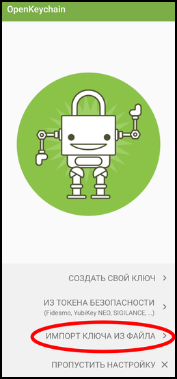  
Откроется диалог выбора файла. Выбрать нужный файл на гуглодрайве или локально.

2. Ввести пароль, который был создан во время экспорта ключа командой  `gpg --armor
--gen-random 1 20`, нажать **[Разблокировать]**:  
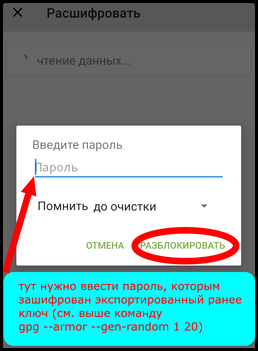

3. Нажать **[Резервный ключ (нажмите для импортирования)]**:  
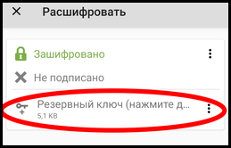

4. Нажать **[Импорт]**:  
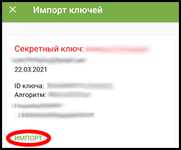

5. Финальный экран в случае удачи:  
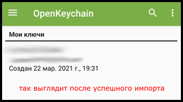  

Если всё прошло успешно, можно (и нужно) удалить из гуглодрайва или из смартфона экспорт ключа,
он больше не понадобится.

**Note**: приложение показалось мне "со странностями", то пароль не подходил (хотя я на 200%
был уверен, что он верный), то вставка в поле пароля из буфера работала как попало. Потом я им
пользовался и вроде бы всё было Ок, но опасения остались.

**РЕЗУЛЬТАТ: Установлен OpenKeychain и в него импортирован ключ.**

### 9. Настройка Password Store

Приложение Password store занимается собственно менеджментом хранилища паролей, оно может
синхронизироваться с github и выполнять автозаполнение диалогов ввода логина/пароля в браузере.

Страница приложения в google play:\
https://play.google.com/store/apps/details?id=dev.msfjarvis.aps

После установки приложения, выполнить следующие действия:

1. Открыть приложение, нажать **[ПОЕХАЛИ]**:  
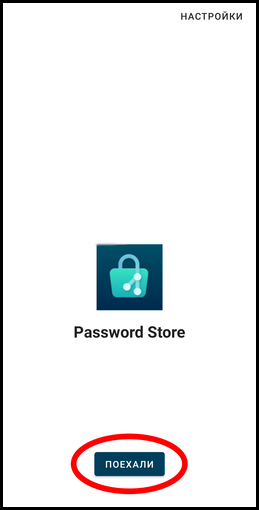

2. Нажать **[КЛОНИРОВАТЬ УДАЛЁННЫЙ РЕПОЗИТОРИЙ]**:  


3. На экране "Информация о репозитории" ввести URL своего репозитория согласно схеме:
`https://github_username@github.com/github_username/repo_name` (почему это делается таким
образом не знаю, на конец марта 21-го года документация у приложения в состоянии "переписывание
с нуля", вот [ссылка](https://github.com/android-password-store/Android-Password-Store/wiki/Setting-up-Password-Store-to-sync-with-a-local-computer) на старую документацию на эту тему). Тип авторизации выбрать **[ПАРОЛЬ]**
(выберется сам, если правильно вбить URL), нажать **[КЛОНИРОВАТЬ]**:  
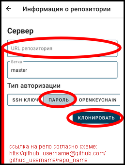

4. Ввести пароль от github:  
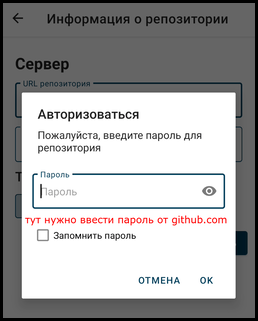

5. Так выглядит приложение в в случае удачного завершения всех действий:  
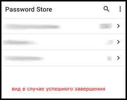

**РЕЗУЛЬТАТ: Установлен Pasword Store и синхронизирован с github.**

------------------------------
### 10. Финальный тюнинг

У меня была такая проблема: Смартфон Xiaomi POCO X3 NFC, OpenKeychain настроен, Password store
синхронизирован с github, я вижу все свои папки и записи паролей но, при тапе на любой записи
происходит быстрая смена картинки туда-обратно, как будто password-store куда-то переключается,
затем переключается обратно. Дело оказалось, в отсутствующем у OpenKeychain разрешении на
отображение всплывающих окон (проделки MIUI). Лечится так:  
*Настройки -> Приложения -> Все приложения -> OpenKeychain -> Другие разрешения -> Отображать
всплывающие окна, когда запущено в фоновом режиме -> Вкл.*  
Можно заодно разрешить ему ещё что-нибудь, на всякий пожарный случай.

Далее делаем следующее:

1. Открыть Password Store, тапнуть на записи пароля, во всплывающем окне OpenKeychain нажать
**[РАЗРЕШИТЬ]**:  
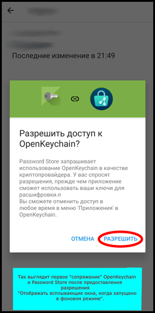

test one\

[](https://www.flickr.com/photos/beaurogers/31833779864/in/photolist-Qv3rFw-34mt9F-a9Cmfy-5Ha3Zi-9msKdv-o3hgjr-hWpUte-4WMsJ1-KUQ8N-deshUb-vssBD-6CQci6-8AFCiD-zsJWT-nNfsgB-dPDwZJ-bn9JGn-5HtSXY-6CUhAL-a4UTXB-ugPum-KUPSo-fBLNm-6CUmpy-4WMsc9-8a7D3T-83KJev-6CQ2bK-nNusHJ-a78rQH-nw3NvT-7aq2qf-8wwBso-3nNceh-ugSKP-4mh4kh-bbeeqH-a7biME-q3PtTf-brFpgb-cg38zw-bXMZc-nJPELD-f58Lmo-bXMYG-bz8AAi-bxNtNT-bXMYi-bXMY6-bXMYv)\

test two\


test three


2. На втором экране также нажать **[РАЗРЕШИТЬ]**:  
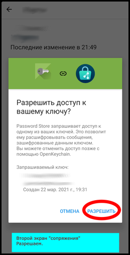

3. Ввести пароль (парольную фразу) от ключа (тот, который был установлен на самом первом шаге
во время генерации ключа), нажать **[РАЗБЛОКИРОВАТЬ]**:  
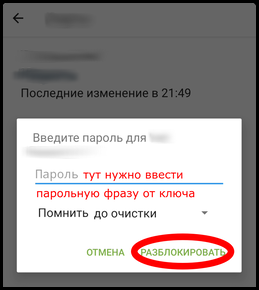

4. Финальный экран с записью пароля:  
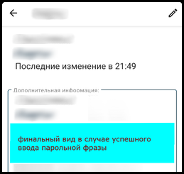

Теперь всё работает. Можно поковырять настройки password store, включить автозаполнение,
авторизацию по отпечатку или что-то ещё.

**РЕЗУЛЬТАТ: ВСЁ РАБОТАЕТ!!!.**
